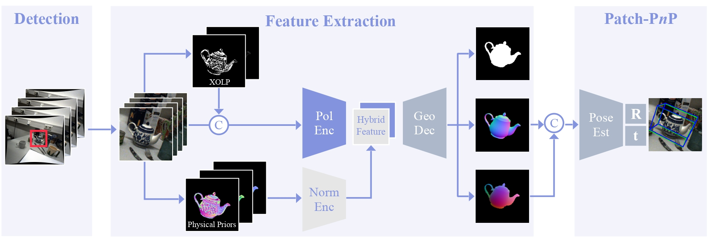

# Polarimetric Pose Prediction
This repo contains the code for the paper:  
**[Polarimetric Pose Prediction](https://arxiv.org/abs/2112.03810)**  
Daoyi Gao*, Yitong Li*, Patrick Ruhkamp*, Iuliia Skobleva*, Magdalena Wysock*, HyunJun Jung, Pengyuan Wang, Arturo Guridi, Benjamin Busam  
ECCV 2022  

## Pipeline Overview
<p align="center">

<p>


## Environment
Ubuntu 18.04/20.04, Python 3.7, Pytorch 1.7.1, CUDA 10.2

## Dataset
The link of the dataset is provided on our project homepage [here](https://daoyig.github.io/PPPNet/)  
The CAD models and the example splits are also included.  

## Citation
```
@InProceedings{gao2022ppp,
    title = {Polarimetric Pose Prediction},
    author = {Daoyi Gao and Yitong Li and Patrick Ruhkamp and Iuliia Skobleva and Magdalena Wysocki and HyunJun Jung and Pengyuan Wang and Arturo Guridi and Benjamin Busam},
    booktitle =  {European Conference on Computer Vision (ECCV)},
    year = {2022},
    month = {October}
}
```
